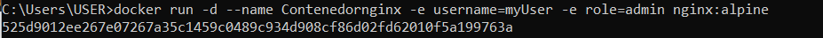
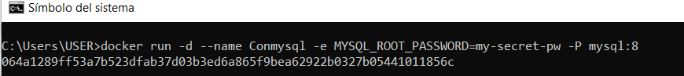
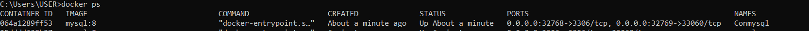
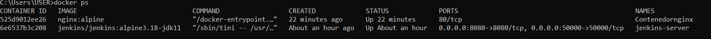
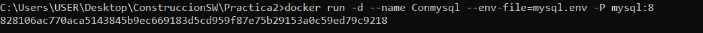
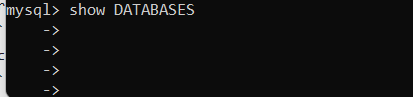

# Variables de Entorno
### ¿Qué son las variables de entorno
Las variables de entorno son pares clave-valor que permiten pasar información al entorno de ejecución de una aplicación. En Docker, se utilizan para configurar el comportamiento del contenedor sin necesidad de modificar el código fuente, permitiendo personalizar su funcionamiento al momento de crear el contenedor.
### Para crear un contenedor con variables de entorno?

```
docker run -d --name <nombre contenedor> -e <nombre variable1>=<valor1> -e <nombre variable2>=<valor2>
```

### Crear un contenedor a partir de la imagen de nginx:alpine con las siguientes variables de entorno: username y role. Para la variable de entorno rol asignar el valor admin.
```
docker run -d --name Contenedornginx -e username=myUser -e role=admin nginx:alpine
```



### Crear un contenedor con mysql:8 , mapear todos los puertos
```
docker run -d --name Conmysql -e MYSQL_ROOT_PASSWORD=my-secret-pw -P mysql:8
```


### ¿El contenedor se está ejecutando?
Si el contenedor aparece en la lista, significa que se está ejecutando.
```
docker ps
```



### Eliminar el contenedor creado con mysql:8 
```
docker rm -f Conmysql
```
Ya no aparecera en lista


### Para crear un contenedor con variables de entorno especificadas
- Portabilidad: Las aplicaciones se vuelven más portátiles y pueden ser desplegadas en diferentes entornos (desarrollo, pruebas, producción) simplemente cambiando el archivo de variables de entorno.
- Centralización: Todas las configuraciones importantes se centralizan en un solo lugar, lo que facilita la gestión y auditoría de las configuraciones.
- Consistencia: Asegura que todos los miembros del equipo de desarrollo o los entornos de despliegue utilicen las mismas configuraciones.
- Evitar Exposición en el Código: Mantener variables sensibles como contraseñas, claves API, y tokens fuera del código fuente reduce el riesgo de exposición accidental a través del control de versiones.
- Control de Acceso: Los archivos de variables de entorno pueden ser gestionados con permisos específicos, limitando quién puede ver o modificar la configuración sensible.

Previo a esto es necesario crear el archivo y colocar las variables en un archivo, **.env** se ha convertido en una convención estándar, pero también es posible usar cualquier extensión como **.txt**.
```
docker run -d --name <nombre contenedor> --env-file=<nombreArchivo>.<extensión> <nombre imagen>
```
**Considerar**
Es necesario especificar la ruta absoluta del archivo si este se encuentra en una ubicación diferente a la que estás ejecutando el comando docker run.

### Crear un contenedor con mysql:8 , mapear todos los puertos y configurar las variables de entorno mediante un archivo
Primero creamos nuestro archivo .env escribimos
```
MYSQL_ROOT_PASSWORD=secretpw
```
Se puede agregar más variables si es necesario, como MYSQL_DATABASE para crear una base de datos específica al iniciar el contenedor.

Segundo al crear el contenedor 
```
docker run -d --name Conmysql --env-file=mysql.env -P mysql:8
```


### ¿Qué bases de datos existen en el contenedor creado?
Para listar las bases de datos existentes en el contenedor de MySQL, accedemos al contenedor:
```
docker exec -it Conmysql mysql -uroot -p
```
Ingresamos la contraseña antes indicada en el .env


Una vez dentro del cliente de MySQL, puedes ejecutar el siguiente comando:
```
SHOW DATABASES;

```

En este caso no hay bases de datos.
