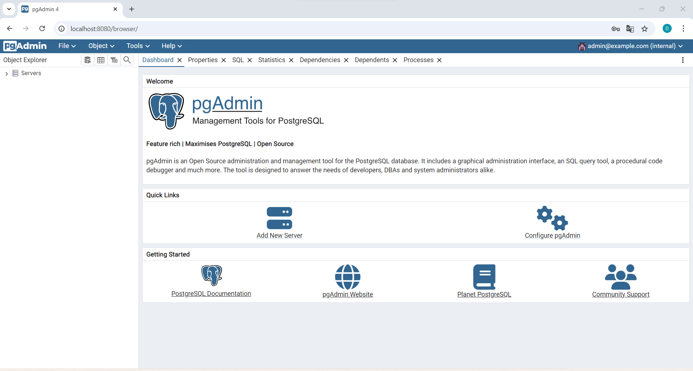

### Crear contenedor de Postgres sin que exponga los puertos. Usar la imagen: postgres:11.21-alpine3.17

```
docker run -d --name postgres-container -e POSTGRES_PASSWORD=secretpassword postgres:11.21-alpine3.17
```


### Crear un cliente de postgres. Usar la imagen: dpage/pgadmin4
Paso 1: Creamos una red en Docker 
```
docker network create postgres-network
```
Paso 2: Ejecutar el contenedor Postgres en la red creada previamente
```
docker run -d --name postgres-container --network postgres-network -e POSTGRES_PASSWORD=mysecretpassword postgres:11.21-alpine3.17
```
Paso 3: Ejecutar pgAdmin en la misma red
```
docker run -d --name pgadmin-container --network postgres-network -e PGADMIN_DEFAULT_EMAIL=admin@example.com -e PGADMIN_DEFAULT_PASSWORD=admin -p 8080:80 dpage/pgadmin4
```


La figura presenta el esquema creado en donde los puertos son:
- a: 8080 puerto de pgAdmin en el host.
- b: 80 puerto interno del contenedor pgAdmin.
- c: 5432 puerto interno del contenedor de PostgreSQL.


## Desde el cliente
### Acceder desde el cliente al servidor postgres creado.



### Crear la base de datos info, y dentro de esa base la tabla personas, con id (serial) y nombre (varchar), agregar un par de registros en la tabla, obligatorio incluir su nombre.
Paso 1: Accedemos al contenedor Postgre
```
docker exec -it postgres-container psql -U postgres
```
Paso 2: Crear la base de datos
```
CREATE DATABASE info;
```
Paso 3: Conectarse a la base de datos
```
\c info
```
Paso 4: Creamos la tabla personas
```
CREATE TABLE personas (
    id SERIAL PRIMARY KEY,
    nombre VARCHAR(255) NOT NULL
);
```
Paso 5: Insertar registros en la tabla
```
INSERT INTO personas (nombre) VALUES ('Daniela'), ('Guachamin');
```

## Desde el servidor postgresl
### Acceder al servidor
```
docker exec -it postgres-container psql -U postgres
```
### Conectarse a la base de datos info
```
\c info
```
### Realizar un select *from personas
```
SELECT * FROM personas;
```

