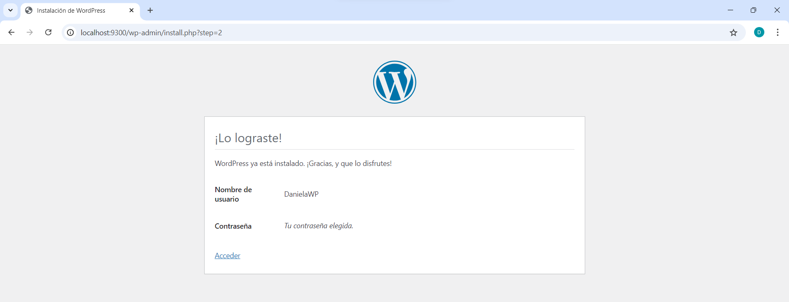
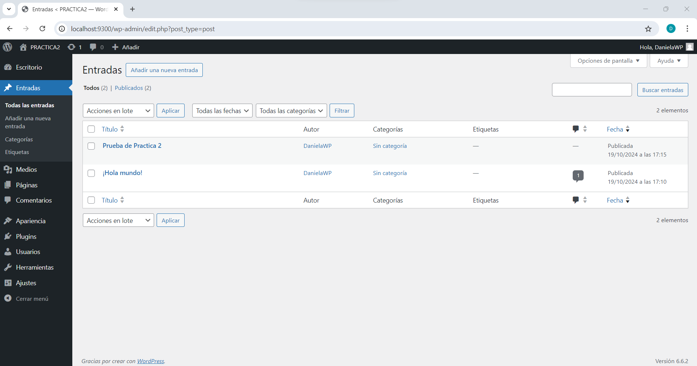
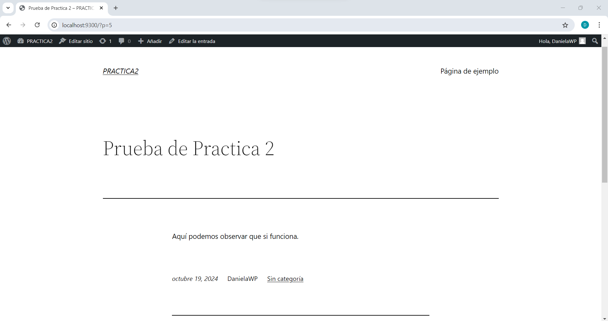
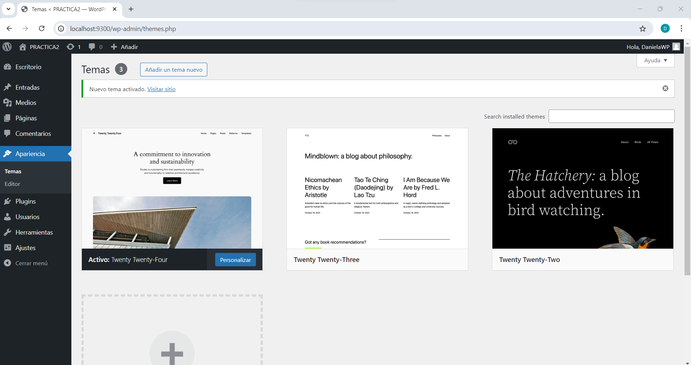
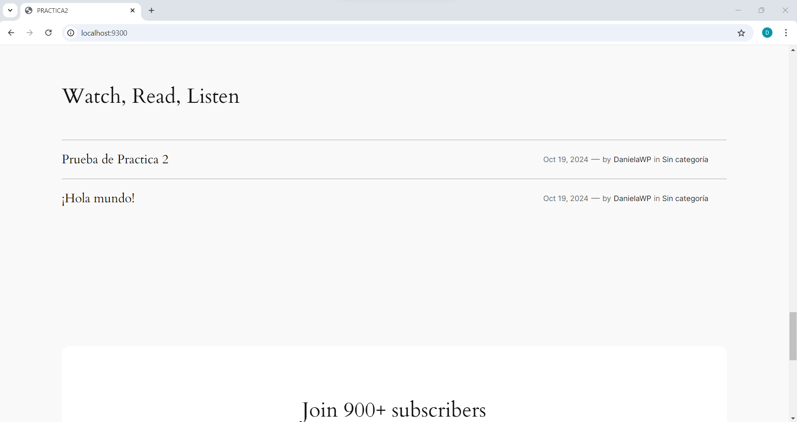

## Esquema para el ejercicio


### Crear la red
```
docker network create net-wp
```

### Crear el contenedor mysql a partir de la imagen mysql:8, configurar las variables de entorno necesarias
```
docker run -d --name mysql-wp --network net-wp -e MYSQL_ROOT_PASSWORD=password -e MYSQL_DATABASE=wordpress -e MYSQL_USER=wpuser -e MYSQL_PASSWORD=wppassword mysql:8
```
### Crear el contenedor wordpress a partir de la imagen: wordpress, configurar las variables de entorno necesarias
```
docker run -d --name wordpress --network net-wp -e WORDPRESS_DB_HOST=mysql-wp:3306 -e WORDPRESS_DB_USER=wpuser -e WORDPRESS_DB_PASSWORD=wppassword -e WORDPRESS_DB_NAME=wordpress -p 9300:80 wordpress
```

De acuerdo con el trabajo realizado, en el esquema de ejercicio el puerto a es 9300. Este es el puerto que mapea el puerto 80 del contenedor de WordPress hacia la máquina local.

Ingresar desde el navegador al wordpress y finalizar la configuración de instalación.


Desde el panel de admin: cambiar el tema y crear una nueva publicación.
Ingresar a: http://localhost:9300/ 
recordar que a es el puerto que usó para el mapeo con wordpress
PUBLICACIÓN


APARIENCIA


### Eliminar el contenedor wordpress
```
docker rm -f wordpress
```
### Crear nuevamente el contenedor wordpress
Ingresar a: http://localhost:9300/ 
recordar que a es el puerto que usó para el mapeo con wordpress

### ¿Qué ha sucedido, qué puede observar?
Al crear nuevamente el contenedor e ingresar a:http://localhost:9300/ , se puede observar que WordPress no ha perdido la configuración previa ni las publicaciones.




